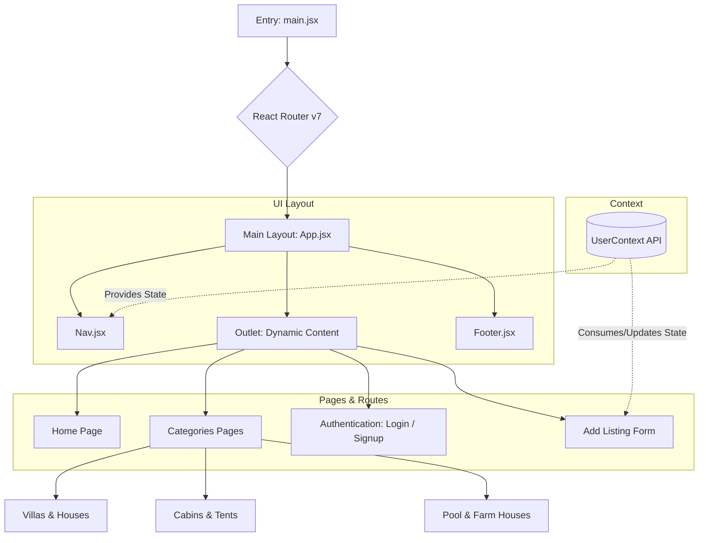

# 🏡 Rentora - Private Property Rental Platform


**Deployed Application:** [https://rentoraaa.netlify.app/](https://rentoraaa.netlify.app/)

Rentora is a modern, responsive React web application designed to help users discover and list private rental properties. From modern villas and cozy cabins to sprawling farmhouses and serene pool houses, Rentora offers a seamless browsing experience categorized perfectly for your next stay.

---

## ✨ Key Features

- **Dynamic Routing:** Built utilizing React Router v7 for lightning-fast, seamless navigation between property categories.
- **Categorized Listings:** Easily filter properties across 9 unique categories (Trending, Houses, Rooms, Farm Houses, Pool Houses, Tent Houses, Cabins, Shops, and Forest Houses).
- **Global State Management:** Employs React's Context API to manage user inputs and new property listing states.
- **Add Listing Portal:** Includes a dynamic form allowing users to submit new properties complete with images, location, descriptions, and pricing.
- **Component-Driven UI:** Highly reusable `Card` components utilized globally for displaying property assets.

---

## 🏗️ Application Architecture & Flow

The following diagram illustrates the component architecture and data flow of the application:



---

## 🛠️ Technology Stack

- **Frontend Framework:** React 19 (Vite)
- **Routing:** React Router v7
- **State Management:** Context API (`createContext`, `useContext`)
- **Styling:** Vanilla CSS (Flexbox / Grid layouts)
- **Icons:** `react-icons`

---

## 🚀 Getting Started

If you want to clone and run this project locally, follow these steps:

### Prerequisites
Make sure you have Node.js installed on your machine.

### Installation

1. **Clone the repository**
   ```bash
   git clone https://github.com/ushantsingh/Rentora.git
   cd Rentora
   ```

2. **Install dependencies**
   ```bash
   npm install
   ```

3. **Start the development server**
   ```bash
   npm run dev
   ```

4. **Open your browser**
   Navigate to `http://localhost:5173` to view the app locally.

---

## 📂 Project Structure

```text
src/
├── assets/                 # Image assets and logos
├── components/
│   ├── card/               # Reusable property card component
│   ├── categories/         # Category-specific rendering components
│   ├── footer/             # Global footer component
│   ├── listing/            # Form to add new property listings
│   ├── login/              # User authentication
│   ├── nav/                # Main navigation bar
│   └── signup/             # User registration
├── context/
│   └── UserContext.jsx     # Global state management
├── home/
│   └── Home.jsx            # Main landing page
├── App.jsx                 # Root layout wrapping Outlet
├── App.css                 # Global styles
└── main.jsx                # App entry point & Router configuration
```

---

## 🤝 Contributing
Contributions, issues, and feature requests are welcome! Feel free to check the issues page.
